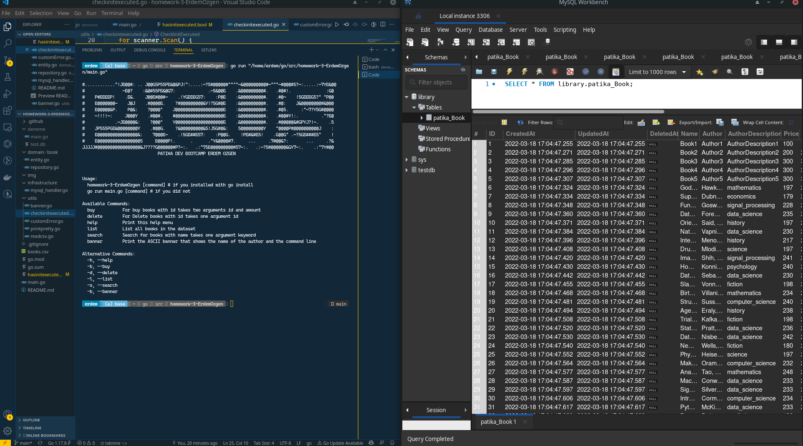
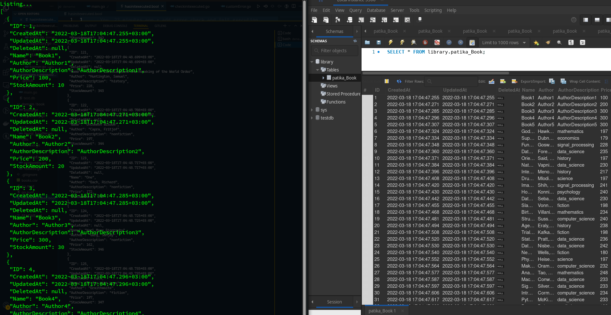
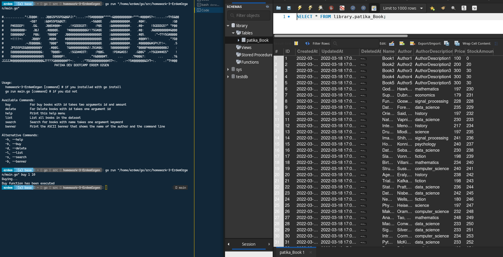
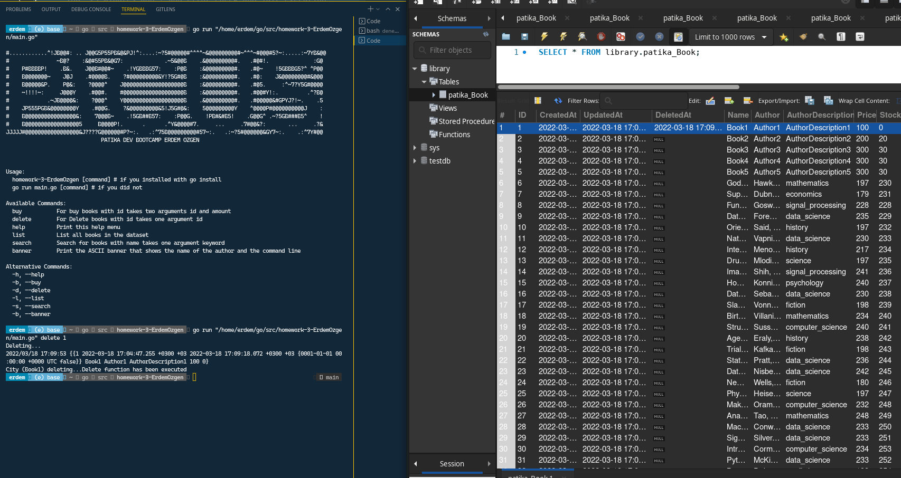
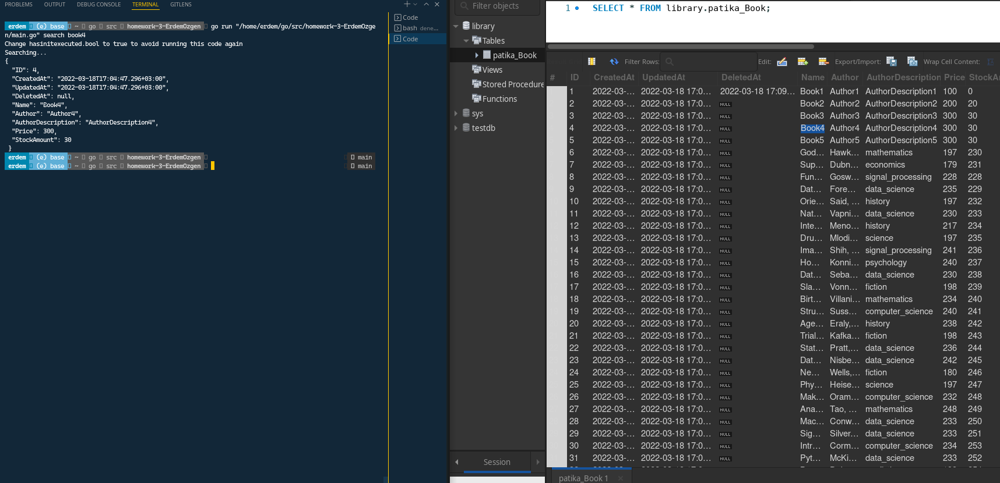

# homework-3-ErdemOzgen
homework-3-ErdemOzgen created by GitHub Classroom

# Run Mysql Database in Docker
```bash
docker run --name mysql -p 3306:3306 -e MYSQL_ROOT_PASSWORD=root -e MYSQL_DATABASE=testdb -e MYSQL_USER=admin -e MYSQL_PASSWORD=root -d mysql
```
Create new schema with name "library" in the database with Mysql Workbench
```sql
CREATE SCHEMA `library` DEFAULT CHARACTER SET utf8mb4 COLLATE utf8mb4_0900_ai_ci ;
```
#### IF YOU RUN CODE AND DOESNT WANT TO INSERT SAMPLE DATA CHANGE 0 to 1 in hasinitexecuted.bool file
[file](./hasinitexecuted.bool)

# How to install ?

```bash
go get ./...
go install 
homework-3-ErdemOzgen
```
# How it works ?

* Use this for see help
```bash
homework-3-ErdemOzgen help
```



* Use this for list all books inserted at database
```bash
homework-3-ErdemOzgen list
```


* Use this for Buy books by ID and amount of books
```bash
homework-3-ErdemOzgen buy 1 10
```


* Use this for Delete book from Database
```bash
homework-3-ErdemOzgen delete 1
```


* Use this for search book by names
```bash
homework-3-ErdemOzgen search Book4
```
